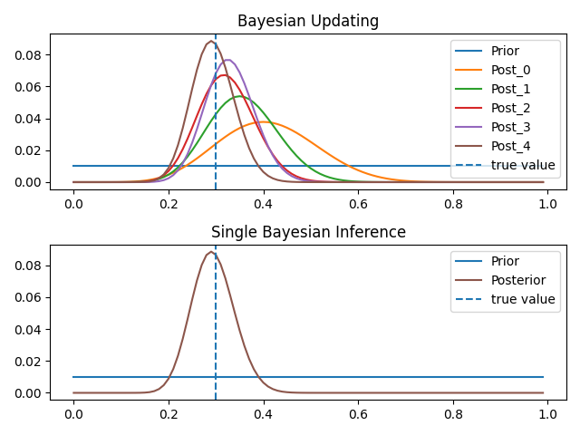
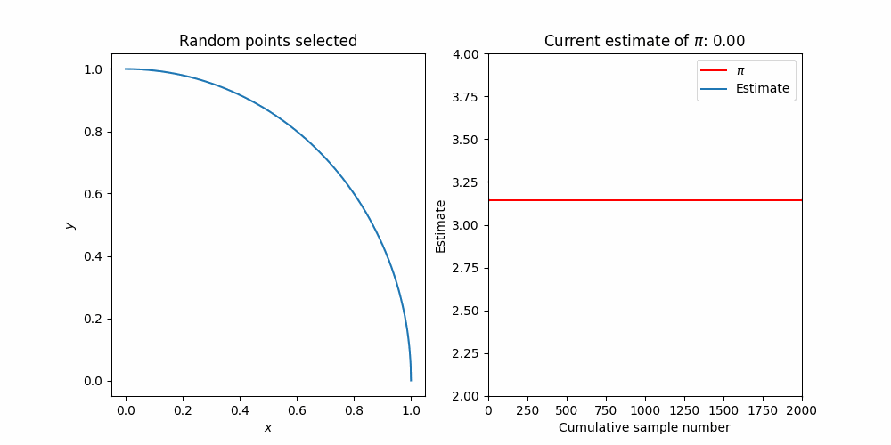

# Computational Statistics For Quantitative Finance

## What this book is
This notebook is a set of short guided projects to help build skills and intuition for the types of problems we have found to be useful for a career in Quantitative Finance. The main topics we will try focus on are
* Writing fast, vectorized python code
* Statistics, probability, and Bayesian inference
* Linear algebra and applications to statistical foundations of ML
* Monte Carlo methods and Markov-Chain processes for statistical models
* Introduction to Game Theory

Each of the 5 topics are structured with two projects. 
The first aims to introduce the new concept and guide you through a simple example with short exercises to build familiarity with the subject. 
The second project is a more advanced application of the topic, with only an introduction to the problem and a few goals to get you started, being more open-ended for you to explore.

1. ### Linear Regression
   * project a 
   * project b
2. ### Bayesian Inference
   * Coins in a bag
   * Measuring the expansion of the universe (Cosmology)
3. ### Markov-Chain Monte-Carlo
   * Estimating Pi
   * Ising Model 
4. ### Principle Component Analysis
   * project a
   * project b
5. ### Game Theory
   * Rock Paper Scissors
   * project b

These projects hope to peak your interest and show you what is out there. 

## What this book is NOT
This is not for interview preperation. There are lots of good existing sources for that (a few we liked linked at the bottom). These projects should be for interest in the style of problems that traders and researchers work on in the day to day at Quant firms.

This is not the best use of your time the weekend before your interview. You can easily spend months learning each of these topics in far more depth and nuance, as they are all extremely rich and we only scratch the surface.

## Gallery
Here is a highlight of some of the results which you should be able to acheive after finishing this book.

<figure>
  
  <figcaption>Bayesian updating of flipping a biased coin.</figcaption>
</figure>

&nbsp;
 <!-- Add vertical spacing -->

<figure>
  
  <figcaption>Probability distribution of Dark matter / Dark energy content of universe from supernova data</figcaption>
</figure>

&nbsp;
 <!-- Add vertical spacing -->

<figure>
  
  <figcaption>Monte Carlo moving estimate of pi</figcaption>
</figure>

&nbsp;
 <!-- Add vertical spacing -->

<figure>
  
  <figcaption>Measured phase transition in the statistical Ising model using MCMC</figcaption>
</figure>

